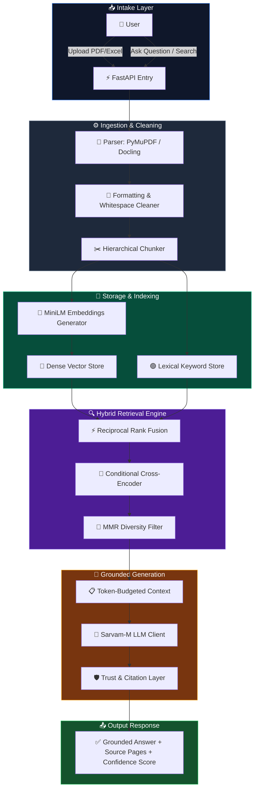

<div align="center">

<!-- Header Banner -->


<!-- Badges -->
[](https://python.org)
[](https://fastapi.tiangolo.com)
[](https://github.com/facebookresearch/faiss)
[](LICENSE)

<br/>

<!-- Repository Statistics -->


<br/>

> **Advanced-RAG-learning-system** represents a state-of-the-art, production-grade AI platform for document exploration and personalized learning. By combining dense semantic search (via FAISS) and keyword-based lexical retrieval (via BM25) into a unified hybrid RAG framework, it ensures factual, citation-backed response generation, automatic curriculum mapping, and an engaging interactive learning flow.


</div>

---

## ⚡ Quick Start Guide

Set up and launch your Advanced-RAG-learning-system environment in just a few minutes:

### 1. Download & Installation
```bash
# Clone the codebase
git clone https://github.com/gunjnnan2005/Advanced-RAG-learning-system.git
cd Advanced-RAG-learning-system

# Navigate to backend directory and build a virtual env
cd backend
python -m venv venv
venv\Scripts\activate          # Windows activation
# source venv/bin/activate     # macOS/Linux activation

# Install required packages
pip install -r requirements.txt
```

### 2. Configuration Setup
Copy the configuration template to create your active environment variables:
```bash
cp .env.example .env
```
Open `.env` and provide your API authorization credential:
```env
SARVAM_API_KEY=your_sarvam_api_key_here
```

### 3. Running the Server
Launch the FastAPI backend service:
```bash
uvicorn app.main:app --host 0.0.0.0 --port 8000
```
*   🌐 **Main Dashboard**: `http://localhost:8000`
*   📚 **Interactive Syllabus Outline**: `http://localhost:8000/course.html`
*   🔍 **Advanced Search Portal**: `http://localhost:8000/search.html`
*   📑 **Interactive OpenAPI Specs**: `http://localhost:8000/docs`

---

## 🔬 Core Technology Stack

The Advanced-RAG-learning-system features a clean, highly efficient architecture utilizing:

*   **API Framework**: [FastAPI](https://fastapi.tiangolo.com) + [Uvicorn](https://www.uvicorn.org) asynchronous backend routing.
*   **Semantic Vector Scanning**: [FAISS](https://github.com/facebookresearch/faiss) dense similarity search indexing.
*   **Embedding Generator**: [Sentence-Transformers](https://sbert.net) (employing the `all-MiniLM-L6-v2` 384-dimension model).
*   **Keyword Retrieval**: Custom BM25 indexing and tokenizer implementation.
*   **Persistent Storage**: SQLite database integration utilizing [SQLAlchemy 2.0](https://www.sqlalchemy.org) ORM.
*   **Document Parsing**: PyMuPDF, Docling, and optical character recognition (OCR) capabilities.
*   **Web Frontend**: Single Page Application structure written in pure Vanilla JS and responsive Vanilla CSS.

---

## 🏗️ Platform Architecture & Data Flow

Our hybrid retrieval engine runs two simultaneous pipelines to optimize contextual coverage and query alignment:



---

## 🚀 Key Platform Features

*   **Fact-Checked Responses (Trust Layer)**: Strict prompt bounds eliminate hallucinations. Every generated answer features page citation details and a reliability index (High, Medium, or Low).
*   **Interactive Search Console**: Google-style search routing supporting Keyword, Hybrid, AI, or Automated options, complete with spelling suggestions and instant auto-completion.
*   **Automated Syllabus Mapper**: Structures long reference books into hierarchical course modules (`Subject → Unit → Topic → Subtopic → Content`) shown in an interactive syllabus tree.
*   **Dynamic Reranking**: Applies cross-encoder scoring dynamically based on scoring gap thresholds to optimize retrieval accuracy without adding latency.
*   **Assessment & Testing Tool**: Automatically pulls key concepts from parsed materials to build multiple-choice quizzes, mock exams, and revision flashcards.
*   **Knowledge Gap Tracker**: Analyzes student quiz responses to pinpoint weakness clusters and offers customized study review lists.
*   **Gamified Study Milestones**: Rewards learning milestones (reading notes, correct answers, consecutive login streaks) with XP points and places users on a global board.

---

## 📊 Scientific Ablation & Performance Evaluation

The built-in evaluation harness (`evaluation/run_evaluation.py`) measures the platform's retrieval and answer metrics against benchmark datasets.

### Ablation Study Results (Dataset A - 60 Queries)

| Configuration | Recall@3 | Recall@5 | MRR | Semantic Sim | Hallucination Rate |
| :--- | :---: | :---: | :---: | :---: | :---: |
| Dense Vector Only (FAISS) | 0.593 | 0.700 | 0.781 | **0.642** | 2.0% |
| Lexical Only (BM25) | 0.567 | 0.655 | **0.800** | 0.570 | 8.0% |
| **Hybrid (FAISS + BM25 + RRF)** | **0.598** | **0.720** | 0.793 | 0.599 | **2.0%** |

### Key Evaluation Findings
1.  **Enhanced Recall**: The hybrid RRF method yields a **+2.9%** boost in Recall@5 compared to pure semantic search (raising recall from 0.700 to 0.720) and a **+9.9%** gain over lexical-only search.
2.  **Hallucination Control**: BM25 keyword matching alone leads to an **8.0%** fabrication rate. Incorporating dense semantic indexing drops hallucinations to a minimal **2.0%**.
3.  **Trust Level Verification**: The confidence grading formula achieves a **95.7% accuracy** rate for high-confidence predictions, preventing inaccurate data from showing.

---

## 📦 Project Structure

```text
Advanced-RAG-learning-system/
├── 📂 backend/
│   ├── 📂 app/
│   │   ├── 🚀 main.py                 ← FastAPI system startup & event loops
│   │   ├── ⚙️ config.py               ← Environment settings & configuration loading
│   │   ├── 🧠 state.py                ← Cache management & FAISS/BM25 index holders
│   │   ├── 🗄️ database.py             ← Database tables and ORM sessions
│   │   │
│   │   ├── 📂 api/routes.py           ← API endpoints and controller logic
│   │   ├── 📂 chunking/               ← Text parsing, table mapping, & hierarchy logic
│   │   ├── 📂 parser/                 ← PDF parsing utilities (Docling, PDFMiner)
│   │   ├── 📂 rag/                    ← Embeddings, FAISS storage, and LLM routes
│   │   ├── 📂 retrieval/              ← Hybrid RRF search & context window handling
│   │   ├── 📂 reranker/               ← Conditional cross-encoder re-scoring
│   │   ├── 📂 personalization/        ← Student gap analysis and suggestions
│   │   └── 📂 gamification/           ← XP awarding, streaks, and boards
│   │
│   ├── 📂 frontend/
│   │   ├── 🌐 index.html              ← SPA master interface layout
│   │   ├── ⚡ app.js                   ← Core client-side interactions and view router
│   │   ├── 🎨 styles.css              ← Design system layout & variables
│   │   ├── 📖 course.html / js / css  ← Structured syllabus viewer
│   │   └── 🔍 search.html / js / css  ← Search view page
│   │
│   └── 📋 requirements.txt            ← Backend python libraries
│
├── 📂 docs/                           ← System architecture documentation
├── 📄 .env.example                    ← Configuration template
├── 📄 .gitignore
└── 📄 README.md                       ← Main documentation (You are here)
```

---

## 📡 Essential REST API Endpoints

Below are some of the main routes exposed by the backend:

| Endpoint | Method | Description |
| :--- | :---: | :--- |
| `/api/upload` | `POST` | Upload PDF or Excel documents to the ingestion pipeline. |
| `/api/ask` | `POST` | Execute a query against the RAG pipeline to generate a grounded answer. |
| `/api/search` | `POST` | Perform keyword, hybrid, or AI-assisted search across documents. |
| `/api/library/hierarchy/{doc_id}` | `GET` | Retrieve the structured course hierarchy tree. |
| `/api/quiz/generate` | `POST` | Auto-generate MCQ quizzes from document topics. |
| `/api/weakness/{user_id}` | `GET` | Fetch weak topics and personalized review recommendations. |
| `/api/leaderboard` | `GET` | Retrieve cached gamification leaderboard. |

---

## ⚖️ License & Contributors

Licensed under the [MIT License](LICENSE).

### Author & Contributors
*   🧑‍💻 **Gunjan Nandeshwar** — Lead Architect & Engineer (RAG Pipeline, Retrieval, Evaluation, and UI)
*   Open to community contributions! Open a pull request or issue to get involved.
